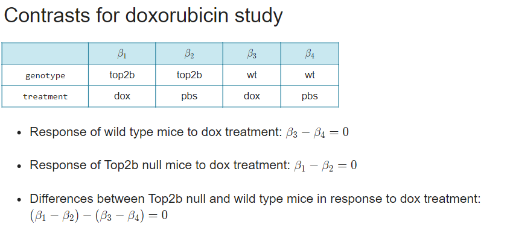

```{r setup, include=FALSE}
knitr::opts_chunk$set(echo = TRUE)
```

### Putting it all together: Model the Data

Build the design matrix: model.matrix
Construct the contrasts matrix: makeContrasts
test the contrasts: lmFit, contrasts.fit, and eBayes


## Group-means model:
Unfortunately,  we don't have access to this data :(
y=B1X1 + B2X2 + B3X3 + B4X4 + E

Create a coefficient for each group:
Y=B1(X1) + B2(X2) + B3(X3) + B4(X4) + E
B1 = mean in top2b mice+dox
B2 = mean in top2b mice+pbs
B3 = mean in WT mice+dox
B4 = mean in WT mice+pbs



# Testing the doxorubicin study
Fit the model coefficients with lmFit

Fit the contrasts with contrasts.fit

Calculate the t-statistics with eBayes

# Create the design matrix:
```{r}
# Create single variable
group <- with(pData(eset), paste(genotype, treatment, sep = "."))
group <- factor(group)

# Create design matrix with no intercept
design <- model.matrix(~0 + group)
colnames(design) <- levels(group)

# Count the number of samples modeled by each coefficient
colSums(design)
```

# Create a contrasts matrix:
```{r}
cm <- makeContrasts(dox_wt = wt.dox - wt.pbs,
                    dox_top2b = top2b.dox - top2b.pbs,
                    interaction = (top2b.dox - top2b.pbs) -
                                  (wt.dox - wt.pbs),
                    levels = design)

```

# summarize
```{r}
# Fit coefficients
fit <- lmFit(eset, design)

# Fit contrasts
fit2 <- contrasts.fit(fit, contrasts = cm)

# Calculate t-statistics
fit2 <- eBayes(fit2)

# Summarize results
results <- decideTests(fit2)
summary(results)
# Create a Venn diagram
vennDiagram(results)
```

#Inspect the results

We confirm that dox only affects the WT mice, but not Top2b-/- mice

The interaction term shows overlap with the WT only.

# Histograms of p-values:
limma function topTable: We will need to specify the contrast this time around
```{r}

```

# Visualize as volcano plots:
Again, specify the contrasts:
```{r}


```


# Testing for KEGG enrichment:
Again. specify the contrast - and change the species = "Mm"
```{r}

```